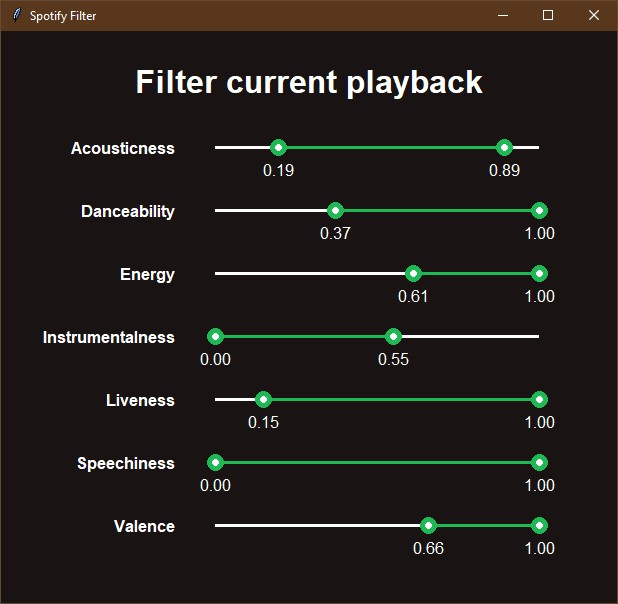

# SpotiFylter
_TOTAL PLAYBACK CONTROL_

## Introduction

**_SpotiFylter_** is your tool to gain total control over your listening experience.
Use its fine-grained sliders to filter out all the tracks you just don't need right now! 

> Tastes can change from minute to minute, but that doesn't mean you don't love your old favorites anymore! 
> That's why **no changes** will be made to your saved playlists.
> **_SpotiFylter_** only affects the current playback.

## How To Set Up

> As **_SpotiFylter_** is still in its development phase, you will need my personal permission **and** assistance to set up the application.
> If you stumbled across this project by chance and don't know me personally, please don't hesitate to get in touch by creating an [Issue](https://github.com/RWitak/SpotiFylter/issues)!

## How To Use

Open up _Spotify_ on any device, using your personal account and start playback of an album, playlist or "radio". 
Then start up **_SpotiFylter_** and start tweaking! 
If you are starting it for the first time, an authorization prompt will pop up to grant **_SpotiFylter_** your permission to influence your current playback.

> _Spotify_ **might** limit the possibilities of **_SpotiFylter_** for non-premium users at any time. 

## What Are These Values?

**_SpotiFylter_** opens access to a bunch of "audio features" which are secretly used by _Spotify_ internally. 
Currently, not all available filters can be manipulated with **_SpotiFylter_**, as some don't lend themselves well to the way it works. 
Additional features might be added in future updates. 

> _Spotify_ **might** change the "audio features" they use. If this happens, **_SpotiFylter_** might stop working.

### Audio Features 
as described by [_Spotify_](https://developer.spotify.com/documentation/web-api/reference/#/operations/get-audio-features):

> ### Supported Features
>
> #### Acousticness
> A confidence measure from 0.0 to 1.0 of whether the track is acoustic. 1.0 represents high confidence the track is acoustic.
> 
> #### Danceability
> Danceability describes how suitable a track is for dancing based on a combination of musical elements including tempo, rhythm stability, beat strength, and overall regularity. A value of 0.0 is least danceable and 1.0 is most danceable.
> 
> #### Energy
> Energy is a measure from 0.0 to 1.0 and represents a perceptual measure of intensity and activity. Typically, energetic tracks feel fast, loud, and noisy. For example, death metal has high energy, while a Bach prelude scores low on the scale. Perceptual features contributing to this attribute include dynamic range, perceived loudness, timbre, onset rate, and general entropy.
> 
> #### Instrumentalness
> Predicts whether a track contains no vocals. "Ooh" and "aah" sounds are treated as instrumental in this context. Rap or spoken word tracks are clearly "vocal". The closer the instrumentalness value is to 1.0, the greater likelihood the track contains no vocal content. Values above 0.5 are intended to represent instrumental tracks, but confidence is higher as the value approaches 1.0.
> 
> #### Liveness
> Detects the presence of an audience in the recording. Higher liveness values represent an increased probability that the track was performed live. A value above 0.8 provides strong likelihood that the track is live.
>
> #### Valence
> A measure from 0.0 to 1.0 describing the musical positiveness conveyed by a track. Tracks with high valence sound more positive (e.g. happy, cheerful, euphoric), while tracks with low valence sound more negative (e.g. sad, depressed, angry).
>
> #### Speechiness
> Speechiness detects the presence of spoken words in a track. The more exclusively speech-like the recording (e.g. talk show, audiobook, poetry), the closer to 1.0 the attribute value. Values above 0.66 describe tracks that are probably made entirely of spoken words. Values between 0.33 and 0.66 describe tracks that may contain both music and speech, either in sections or layered, including such cases as rap music. Values below 0.33 most likely represent music and other non-speech-like tracks.

> ### Unsupported Features
>
> #### Loudness
> The overall loudness of a track in decibels (dB). Loudness values are averaged across the entire track and are useful for comparing relative loudness of tracks. Loudness is the quality of a sound that is the primary psychological correlate of physical strength (amplitude). Values typically range between -60 and 0 db.
>
> #### Mode
> Mode indicates the modality (major or minor) of a track, the type of scale from which its melodic content is derived. Major is represented by 1 and minor is 0.
> 
> #### Tempo
> The overall estimated tempo of a track in beats per minute (BPM). In musical terminology, tempo is the speed or pace of a given piece and derives directly from the average beat duration.
> 
> #### Time Signature
> An estimated time signature. The time signature (meter) is a notational convention to specify how many beats are in each bar (or measure). The time signature ranges from 3 to 7 indicating time signatures of "3/4", to "7/4".

___

## License & Copyright

SpotiFylter was created in 2021 by me, Rafael Witak.
It is published under the GNU GPLv3 license, which can be viewed [here](https://www.gnu.org/licenses/gpl-3.0.en.html).
